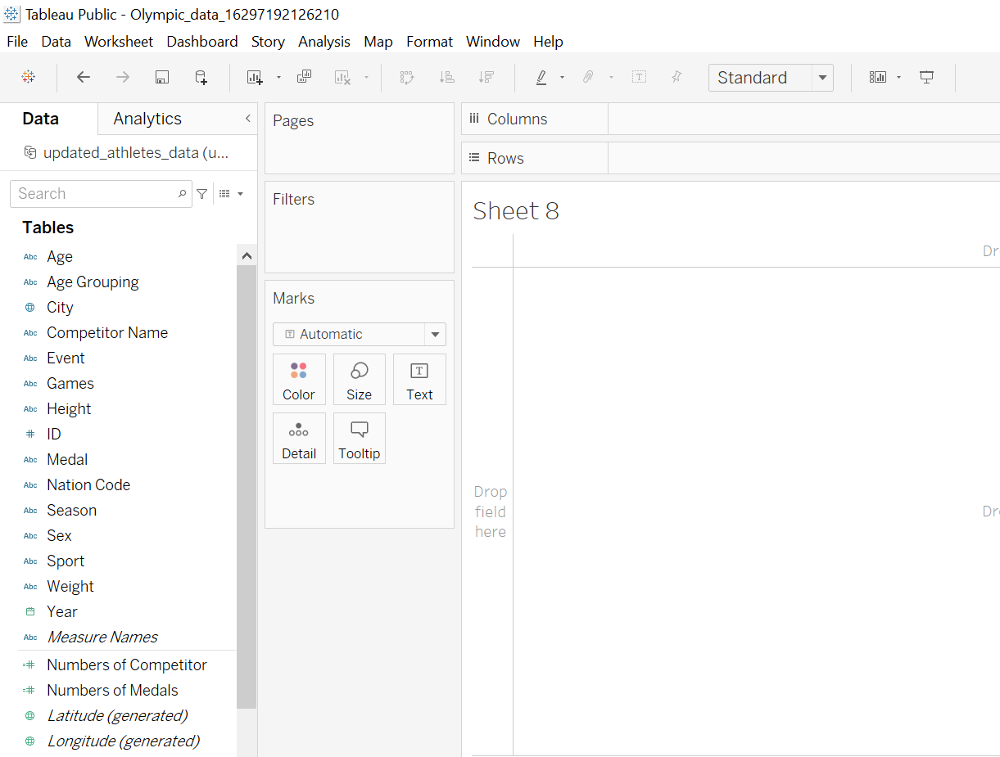

# Olympic-Games-Analysis


## Business Problem
The challenge for those data analyst project is outlined below. This has been used continously to enure that the right data has been selected, transformed and used in the data visualization which is meant to be passed on the business users.

**"As a data analyst working at news company you are asked to visualize data that will help readers understand how countries have performed historically in the summer Olympic Games.**

**You also know that there is an interest in details about the competitors, so if you find anything interesting then dont't hesitate to bring that in also.**

**The main task is still to show historical performance for different countries, with the possibility to select your own country."**

## Data Collection & Table Structures
The necessary data was first put into a SQL database and afterwards transformed using the transformation that you can see below.

#### Olympic Games View

```SELECT
	id,
	name AS 'Competitor Name', --Renamed COLUMN
	CASE
		WHEN sex = 'M' THEN 'Male'
		ELSE 'Female'
	END AS Sex, -- Better name for filters and visualisation
	age,
	CASE
		WHEN Age < 18 THEN 'Under 18'
		WHEN Age BETWEEN 18 AND 25 THEN '18-25'
		WHEN Age BETWEEN 25 AND 30 THEN '25-30'
		WHEN Age > 30 THEN 'Over 30'
	END AS 'Age Grouping',
	height,
	weight,
	NOC AS 'Nation Code',
	year,
	season,
	games,
	city,
	sport,
	event,
	CASE 
		WHEN Medal = 'NA' THEN 'Not Registered' 
		ELSE Medal 
	END AS Medal -- Replaced NA with Not Registered
FROM events
WHERE Season = 'Summer' -- Where Clause to isolate Summer Season
ORDER BY id
```

## Data Model
As this is a view where dimensions and facts have been combined, the data model that is created in Tableau is one table. The query from previous step was loaded in and ran through the dataset to get the desirable dataset and that data is loaded into the Tableau directly.



## Calculations
The following calculations were created in the Tableau Desktop. To lessen the extent of coding, the re-use of measures was emphasized.

Number of Competitors:

#Of Competiors = COUNTD([ID]) <br>
#of Medals = COUNT('Olympic Data')

## Olympic Games Analysis
The finsished dashboard consist of visualization and filters that gives an easy option for the end users to navigate the summer games through history. Some possibilities are to filter by period using year, nation code to focus on one country or look into either a competitor or specific sports over time.

#### **Click the picture to open the dashboard and try it out!**

<a href="https://public.tableau.com/views/Olympic_data_16297192126210/Dashboard1?:language=en-US&:display_count=n&:origin=viz_share_link">
  
</a>
